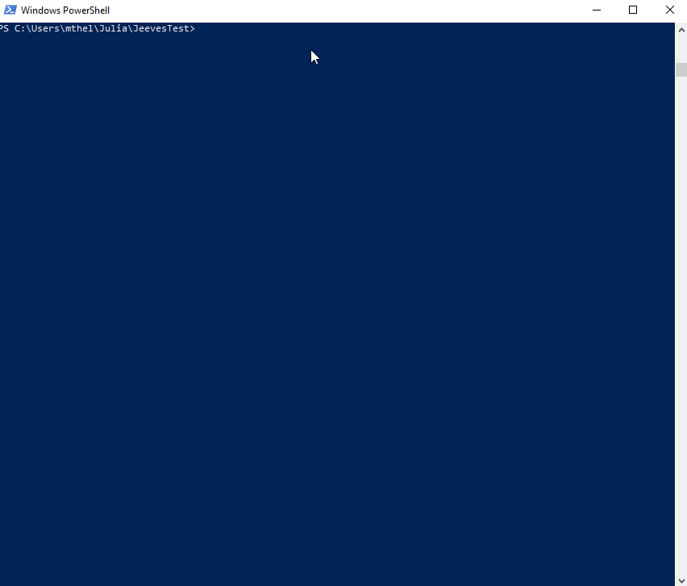

# About

Meet Jeeves. He doesn't do much - but what he does, you'll really like. Jeeves scaffolds simple Julia projects so that you don't have to. Just type `jeeves MyProjectName` into your terminal and Jeeves will set up a new Julia project for you. Open it in VS Code (for example) and the environment will be detected immediately so you can get straight to `Pkg.add`ing and writing useful code.

# Usage

To use Jeeves, save `jeeves.exe` somewhere and add the location to your PATH environment variable. To create a new project, simply navigate to the directory in which you would like the project to be located and call `jeeves <ProjectName>`. You will get a new folder called `<ProjectName>`. If you use VS Code, you can simply `cd` into the newly created folder, open it in VS Code (via `code .`) and you'll have a fresh environment with a `src` folder that includes a `<ProjectName>.jl` file as well as your `Project.toml` and `Manifest.toml` files.

# Security
Downloading `.exe` files that you find on GitHub isn't the safest thing in the world. All of the source code is available here so, if you have the Rust programming language and related tools installed (namely `cargo`), you can compile the binary yourself. If you decide to download and use the `jeeves.exe` file from this repo, make sure that the 
SHA256 checksum matches this one: 

`D487DA82680D843901F2CB3631DE6F100564B396A07088D16A14EE0F781FDFDC`

# New Features

When I say Jeeves doesn't do much, he *really* doesn't do much. Please open an issue here and let me know what new features you would find most useful!